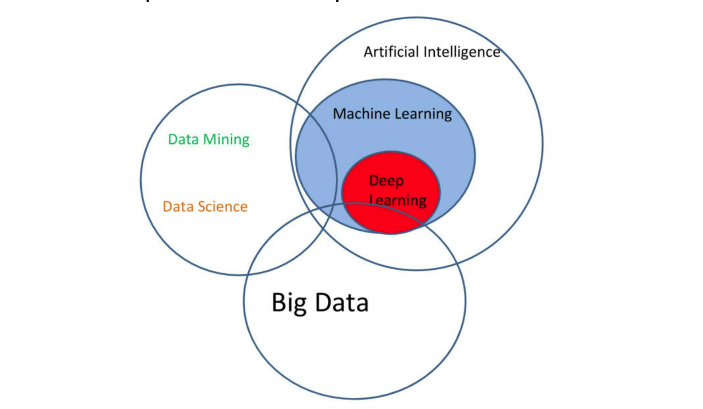

# 同济大学软件工程《机器学习》复习笔记（2026春）
>Author : BH4HVT
>
> e-mail : 2353741@tongji.edu.cn
## 第一章 导论
### 一、机器学习的定义
一系列能够自动从数据中识别出模式的方法，然后利用发现的模式来预测未来数据，或者在不确定性条件下进行其他类型的决策。
### 二、辨析以下几个概念
- **人工智能：** 最宏观的学科目标，让机器模仿人类智能。
- **模式识别：** 早期核心方法，主要从数据中寻找规律并对输入进行分类（如识别手写数字）。常依赖人工设计的特征。
- **机器学习：** 核心是让算法从数据中自动学习，而非通过硬编码规则。它是模式识别的进化版。
- **数据挖掘：** 侧重于从海量数据中发现未知、有价值的知识，常与数据库结合。与机器学习的区别在于目标：挖掘重发现，学习重预测。
- **深度学习：** 机器学习的一个子集，使用多层神经网络自动提取数据的层次化特征。解决了传统机器学习依赖人工特征工程的痛点，尤其擅长图像、语音等复杂数据。
- **大语言模型：** 深度学习在自然语言处理领域的具体应用。

图1：相关概念关系图
### 三、人工智能的发展历史
#### 1.宏观阶段：`推理期 -> 知识期 -> 学习期`
#### 2.学习期的主要流派：`符号主义学习 -> 连接主义学习(基于神经网络) -> 统计学习 -> 连接主义学习(基于深度学习)`
#### 3.技术浪潮发展：`专家系统(知识期) -> 统计方法(学习期) -> 深度学习(学习期) -> 大语言模型(学习期)`
### 四、机器学习分类
#### 1.按输出类型分类：
- **回归：** 输出连续值，如预测PM2.5
- **分类：** 输出离散类别
    - 二分类(如垃圾邮件识别)
    - 多分类(如文件分类)
#### 2.按学习方式分类：
- **监督学习：** 训练数据包含输入和对应的正确输出，模型通过学习输入与输出之间的映射关系来进行预测。
- **无监督学习：** 训练数据只有输入，没有对应的正确输出，模型通过发现数据中的结构或模式来进行分析。
- **半监督学习：** 训练数据包含少量带标签的数据和大量未带标签的数据，模型利用两者的信息来进行学习。
- **强化学习：** 通过与环境交互来学习策略，模型根据奖励信号来调整行为，以最大化长期回报。
- **迁移学习：** 将从一个任务中学到的知识应用到另一个相关但不同的任务中，特别适用于数据有限的新任务。
#### 3.按模型类型分类：
- **线性模型：** 如线性回归、逻辑回归，适用于线性关系的数据。
- **非线性模型：** 如决策树、支持向量机、神经网络，适用于复杂关系的数据。
#### 4.结构化学习：输出的不是简单的标签，而是具有内部结构的对象，如序列、树或图。

## 第二章 模型选择
### 一、核心术语
#### 1.样例(example)&样本(sample)
**样本**是数据集中的一个数据点，**样例**是带有标签的**样本**。
#### 2.特征(feature)
样例的属性或维度，如房价预测中的面积、位置等。
#### 3.标签(label)
样例的目标输出，如房价预测中的价格。
### 二、误差与过拟合
#### 1.误差(error)
模型预测与真实标签之间的差距。
- **训练误差(training error)：** 模型在训练集的错误率。
- **测试误差(test error)：** 模型在测试集上的错误率。
- **泛化误差(generalization error)：** 模型在所有新样本上的错误率。
> 泛化：模型在新样本上的表现能力。
#### 2.过拟合(overfitting)与欠拟合(underfitting)
##### (1)概念
- **过拟合：** 模型在训练集上表现很好，但在测试集上表现差，说明模型过于复杂，捕捉了训练数据中的噪声。
- **欠拟合：** 模型在训练集和测试集上都表现不好，说明模型过于简单，无法捕捉数据中的规律。
##### (2)缓解过拟合的方法
- 减少参数 / 共享参数
- 减少特征
- 早停（Early Stopping）
- 正则化（Regularization）
- Dropout
> 过拟合只能缓解，无法完全消除。
### 三、评估方法(估计泛化能力)
#### 1.留出法(Hold-out)
将数据集分为互斥的训练集和测试集。需要**分层抽样(stratified sampling)** 以保持类别分布一致 **(2026 小测1 T1)**。

**缺点**：未使用全部数据进行训练，评估结果可能不稳定。
#### 2.N折交叉验证(N-Fold Cross-validation)
- 将数据集分成N个子集，每次使用N-1个子集进行训练，剩下的1个子集进行测试，重复N次，最后取平均误差。

- **留一法(Leave-One-Out)**：N等于样本数量，每次只留一个样本作为测试集。
#### 3.自助法(Bootstrap)
从m个样本中有放回的采样m次，得到一个新的训练集，未被采样到的样本(约占36.8%)作为测试集。
#### 4.参数调优(Parameter Tuning)
为每一个参数设定一个范围和变化的步长，然后穷举。最终的模型需要在全部数据D上先进行训练。
### 四、性能度量
#### 1.回归问题
- **均方误差(MSE)**：预测值与真实值之差的平方的平均值。
#### 2.分类问题
##### (1)错误率与准确率
- **错误率(Error Rate)**：分类错误的样本数占总样本数的比例。
- **准确率(Accuracy)**：分类正确的样本数占总样本数的比例。
##### (2)查准率与查全率
- **混淆矩阵(Confusion Matrix)**：用于二分类问题的性能评估工具，包含四个指标：

|            | 预测正类 | 预测负类 |
|------------|----------|----------|
| 实际正类   | TP       | FN       |
| 实际负类   | FP       | TN       |
- **TP(真阳性)**：正确预测为正类的样本数。
- **TN(真阴性)**：正确预测为负类的样本数。
- **FP(假阳性)**：错误预测为正类的样本数。
- **FN(假阴性)**：错误预测为负类的样本数。
- **查准率(Precision)**：预测为正类的样本中实际为正类的比例，计算公式为：

$$
Precision = \frac{TP}{TP + FP} 
$$

- **查全率(Recall)**：实际为正类的样本中被正确预测为正类的比例，计算公式为：

$$
Recall = \frac{TP}{TP + FN}
$$

> 查准率和查全率通常相互矛盾。
- P-R曲线：以查全率为横轴，查准率为纵轴的曲线图，用于评估分类模型在不同阈值下的性能。
- Break-even Point：P-R曲线上查准率和查全率相等的点，表示模型在该阈值下的性能平衡。
##### (3)F1值
- **F1值(F1 Score)**：查准率和查全率的调和平均数，计算公式为：

$$
F1 = 2 \cdot \frac{Precision \cdot Recall}{Precision + Recall} = \frac{2 \cdot TP}{m + TP - TN}
$$

- **Fβ值(Fβ Score)**：查准率和查全率的加权调和平均数，计算公式为：

$$
F_\beta = (1 + \beta^2) \cdot \frac{Precision \cdot Recall}{\beta^2 \cdot Precision + Recall}
$$

> 其中，β是一个非负参数，用于调整查准率和查全率的权重。当β > 1时，Fβ值更重视查全率；当β < 1时，Fβ值更重视查准率；当β = 1时，Fβ值等于F1值。
##### (4)ROC(受试者工作特征)曲线
- **ROC曲线(Receiver Operating Characteristic Curve)**：以假阳性率(FP率)为横轴，真阳性率(TP率，即召回率)为纵轴的曲线图，用于评估分类模型在不同阈值下的性能。
> 假正例率：
> 
> $$
> FPR = \frac{FP}{FP + TN}
> $$
##### (5)AUC(Area Under the ROC Curve)：ROC曲线下的面积，衡量样本预测的排序能力，值越大表示模型性能越好。
> 若一个模型的ROC曲线完全"包住"另一个模型的ROC曲线，则性能更好；若两条ROC曲线相交，则比较AUC值。
##### (6)代价敏感错误率(Cost-sensitive Error Rate)
- 在某些应用中，不同类型的错误具有不同的代价。
- **代价矩阵**： $cost_{ij}$ 表示将第i类样本预测为第j类的代价。
- **代价敏感错误率**：最小化总代价

$$
Cost\text{-}Sensitive\ Error\ Rate = \frac{\sum_{i=1}^{k} \sum_{j=1}^{k} cost_{ij} \cdot N_{ij}}{N}
$$
> 其中， $N_{ij}$ 表示将第i类样本预测为第j类的样本数，N表示总样本数。 
### 五、偏差与方差
#### 1.基本概念
- **偏差(Bias)**：模型预测值与真实值之间的差距，反映了模型的拟合能力。高偏差表示模型过于简单，无法捕捉数据中的规律。
- **方差(Variance)**：模型预测值在不同训练集上的变化程度，反映了模型的稳定性。高方差表示模型过于复杂，对训练数据的噪声敏感。
#### 2.诊断方法
| 现象| 问题 | 解决方法 |
|----------|----------|----------|
| 训练误差高      | 高偏差(欠拟合)       | 增加特征，使用更复杂模型   |
| 训练误差低，但测试误差高 | 高方差(过拟合)       | 增加数据，正则化 |
#### 3.常见模型的方差-偏差特点
| 模型类型 | 偏差 | 方差 |
|----------|----------|----------|
| 线性模型 | 高       | 低       |
| 决策树   | 低       | 高       |
| 神经网络 | 取决于架构和正则化 | 取决  于架构和正则化 |
> 通过调整模型复杂度，可以在偏差和方差之间找到一个平衡点，以获得更好的泛化性能。
